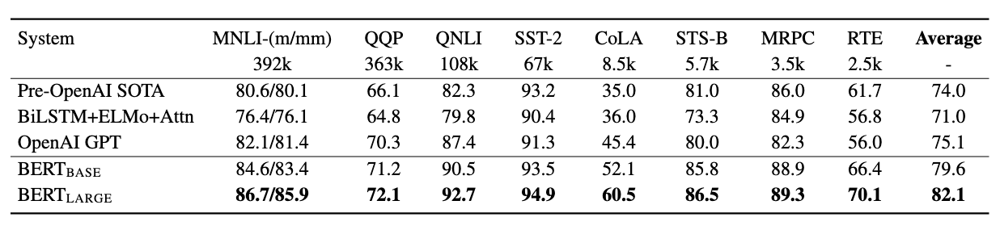
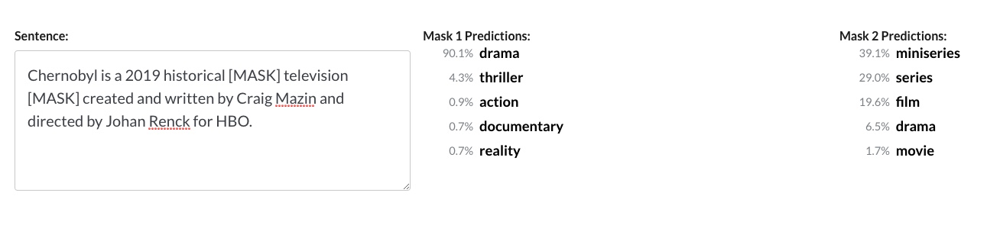
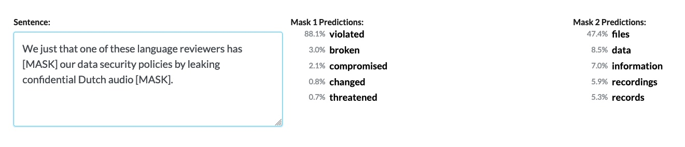

# BERT vs Baseline: A Semantics-First Approach to Summarization

> *Above: 
BERT, ELMo, and Grover express ambivalence at their exorbitant pretraining costs and having their names attached to transformer networks.*

## Table of Contents
* [Overview](#overview)
* [Purpose](#purpose)
* [Setup](#setup)
* [Method and Models](#method-models)
* [BERT](#bert)
* [Analysis](#analysis)
* [On Transfer Learning](#transfer-learning)
* [Measurement and Metrics](#metrics)
* [Datasets](#datasets)
* [References](#references)

## Overview  
The timing of this text summarization project coincides with a special era in Natural Language Processing (NLP), during sudden and enormous gains in model architecture and performance, and in particular, within Transfer Learning methods utilizing recently released models pretrained on enormous corpora (e.g., entire Wikipedia, Reddit, Book Corpus, more). As a result, new SOTA benchmarks are breaking old ones by incredible margins, sometimes on a weekly basis, and each new model hopes to top the metric charts. As NLP researcher Sebastian Ruder notes:  

### "NLP's ImageNet moment has arrived."
  
That is, just a couple of years ago, practitioners in Computer Vision experienced the beginning of a similar leap in model performance while NLP progress remained stagnant in comparison. But much has changed. 

## Purpose  
This project has a two-fold aim:  
- First, to produce two summarization models in order to study the relationship between word and sentence probabilities, token prediction methods, contextual proximity vs semantic inter-sentence coherence, and syntactic representation.  In particular, this project's focus centers on modeling with an emphasis on powerful pretrained networks which for the first time allows NLP to apply and to encourage the use of transfer learning methods. More on these considerations follow later in this document.  
- Second, through an analysis of extractive summarization algorithms to provide informed research within the context of the current state of NLP in its present and dramatic transformation occurring at breakneck speed on a weekly--and sometimes--daily basis.

## Setup
### "OK, what's with the research-y readme text? You said summarization!"

Fair enough. If you'd like to jump straight into the summarizer, here are some simple instructions. Launching the Colab notebook is the quickest and easiest way to take the summarizer for a spin. Clicking on the Colab badge at the top will take your straight there. Everything you need to run the summarizer is contained within the notebook. Once you follow the simple setup instructions there, you'll be presented with three options for summarization:

- A) Reading in a URL from a text-centric site such as Wikipedia, news sites (without a paywall), blogs, etc;
- B) Loading your own text document for summarization;
- C) Simple copy/paste of any kind of text directly into the prompt

NB: For all options, you'll get your summary printed in the notebook's output. But that's not helpful when you want to retain your summary. As such, the summarizer will output a text file of your summary which you can find in the directory `your_summaries`.  

Oh, and you can summarize with either BERT or the baseline model.  

## Method and Models  
The first summarizer serves as a baseline model, a simple algorithm solely using NLTK for processing that does not rely on any form of training or machine learning--just straightforward graph, edge, and weight probabilities for word and sentence inclusion into a final summary (e.g., textrank, pagerank). Given its sparsity, its performance (within reason) was a pleasant surprise.

The second summarizer is quite the opposite: at its bare minimum, it is an enormous, pretrained, and unsupervised language transformer with state-of-the-art architecture with transfer learning as its intention. Its name is BERT. BERT's authors claim the pre-trained versions excel at NLP tasks without a pre-specified intent, but that the models still perform extremely well on "downstream tasks." And for the most part, they're right. Tasks such as classification, question-answering, Named Entity Recognition all do very well without further manipulation. It also performs very well on benchmarking metrics such as SQuAD, MNLI, and MRPC. BERT was trained on the entire Wikipedia corpus as well as the entire Toronto Book corpus. Its parameters are massive. It comes in a variety of sizes and includes multi-lingual options. For this project I utilized the biggest model, BERT-Large, Uncased: 24-layer, 1024-hidden, 16-heads, 340 million parameters. That's right: 340 million hyperparameters.

## So how does BERT work?
The [paper's](https://arxiv.org/abs/1810.04805) authors state:

 > "BERT outperforms previous methods because it is the first *unsupervised, deeply bidirectional* system for pre-training NLP."

BERT considers context as part of its inherent design. Not only is BERT an unsupervised model, it also is a transformer model. No convolutions. No recurrent movement. Its bidirectional capability allows it to consider tokens from both the left *and* right side--on all layers of the net. In other words, it surpasses earlier models capable only of predicting context from one-sided input or "shallow bidirectional" input. In addition, BERT masks (drops) 15 percent of its tokens and predicts on those, further pushing to model relationships among tokens and creating a sophisticated framework for generating probabilities and text output.

On top of my BERT-Large model, I utilize K-Means as a way of graphing relationships and most importantly, measuring cluster proximity via edge weights to determine token similarity. The model also borrows from OpenAI's tokenizer which I learned really is not necessary as BERT's own SentencePiece tokenizer is impressive in its own right.  

Although much is made of BERT's ingesting of enormous corpora, additional training using domain-specific data helps performance as is the case with most pretrained models. I chose from the limited array of standardized NLP summarization datasets. Given the extensive resources necessary to train BERT, not to mention hyperparameter tuning, the BBC News dataset was reasonable in size and includes both full-text articles and accompanying gold summaries. In addition, as you'll read below--if you can summon the patience--my impetus for this project is far less about posting a nice ROUGE or BLEU score which in general is relatively easy to do with pretrained transformer models. Nor am I holding my breath to measure the difference between state-of-the-art architecture and well, one that doesn't learn. You might characterize this difference as morphological even if the words they both produce are not. Instead, my concerns are more closely tied to semantic, syntactic, inter-sentence coherence--human-readability, contextual sophistication--within news text or otherwise. Hence the title.

## Analysis  
For the purposes of demonstration, we'll use summarized examples of a full-text passage passed in from a URL: the Wikipedia page for the critically-acclaimed HBO series, Chernobyl.  
*Full text is excluded here for space and length considerations. However, I've included those files in the repo's [full_text](https://github.com/dhk3136/bert-vs-vanilla-summarization/tree/master/full_text) directory.*

First, let's take a look at how BERT sees the first sentence:

> Chernobyl is a 2019 historical drama television miniseries created and written by Craig Mazin and directed by Johan Renck for HBO.

  

Impressive, yes? Not only can BERT predict "drama" with a high probability, its capability really shines when predicting "miniseries" over "series," which to my mind is a labeling distinction difficult even for a human annotator to make.  

Here's another summary sentence from an article addressing Google Home's privacy concerns:  

> "We just learned that one of these language reviewers has violated our data security policies by leaking confidential Dutch audio data."  

  

BERT intentionally masks a small ratio of words so that it can predict probabilities of the correct word--in context. Part of this masking includes subwords (e.g., I ##ay t## nis) made by BERT's sentence piece tokenizer. This is different from measuring distance or weighted connections as a metric of semantic similarity. In addition, BERT is ambidextrous (maybe too much on the anthropomorphism). The model can take input from both sides of *all layers* which expands its contextual framework resulting in a huge advantage over unidirectional input. 

> Here's the full summary:  
Chernobyl is a 2019 historical drama television miniseries created and written by Craig Mazin and directed by Johan Renck for HBO. The miniseries is based in large part on the recollections of Pripyat locals, as told by Belarusian Nobel laureate Svetlana Alexievich in her book Voices from Chernobyl. Writer Craig Mazin began researching for the project in 2014, by reading books and government reports from inside and outside the Soviet Union. Director Johan Renck heavily criticised the amount of diverse and eye-catching modern windows in the houses, but was not concerned about removing them in post-production.  

> This is what the baseline model returned:
Vladimir Medinsky, Russian culture minister, whose father was one of the Chernobyl liquidators, called the series “Masterfully made” and “filmed with great respect for ordinary people”.Simultaneously with the initial series announcement, it was confirmed that Jared Harris would star in the series.The series centers around the Chernobyl nuclear disaster of April 1986 and the unprecedented cleanup efforts that followed.The protective plastic screens around victims of Acute Radiation Syndrome (ARS) are used to protect the victims from other people due to their weaker immune system.

BERT's summary is a sound one for the most part. It begins by capturing the exact topic of the (way, way longer) full text. It continues with important background information related to the show's research and sources. The last sentence is a dud, however, as it conveys a minor detail with respect to the lengthy full text. Yet, it's not bad at all for a 4-sentence summary task.

The baseline model's results were somewhat extreme in the sense that it provided both useful and extraneous details. While the first and third sentences are eloquent in their description. The second sentence provides a bit of useful information, letting us know who's playing the lead. While this knowledge should not be discarded, its positioning as a top-n sentence is curious. The last sentence provides us with a good piece of trivia, but if you refer to the full text, you'll see that the sentence is a rebuttal to misconceptions about the usage of those plastic screens. Yet, the summary is readable. So, with regard to inter-sentence coherence, what's the problem? Well, there's one glaring mistake the vanilla model could not detect: it never mentions the name of the miniseries. The word Chernobyl appears along with some context, but ultimately, the summary leaves the reader to infer its precise topic.  

Let's look at another example. Here, the full text is a much shorter passage. In fact, it's the abstract from the BERT paper, itself:

BERT:  
> We introduce a new language representation model called BERT, which stands for Bidirectional Encoder Representations from Transformers. As a result, the pre-trained BERT model can be fine-tuned with just one additional output layer to create state-of-the-art models for a wide range of tasks, such as question answering and language inference, without substantial task-specific architecture modifications.

Baseline:
> Unlike recent language representation models, BERT is designed to pre-train deep bidirectional representations from unlabeled text by jointly conditioning on both left and right context in all layers.We introduce a new language representation model called BERT, which stands for Bidirectional Encoder Representations from Transformers. BERT is conceptually simple and empirically powerful.  

First, it's worth noting that an abstract is already a form of summary--or at least a short highlight reel. That's an important detail as extractive selection now has a much lower probability of producing strangely out-of-context sentences.

Similar to the first comparison, the baseline model does reasonably well--that is, with the added help of the authors' preselected sentences. Again, the model fails to provide a topic or reference sentence at the outset, leaving the reader to infer her/his own topic sentence. It does recover well, especially in its concluding line which is short, declarative, and placed well.

BERT improves on the summary by again offering the exact topic right away. While both summaries provide a sentence's worth of best-in-show technical detail, BERT predicts that examples from NLP use cases is an important sentence to include in such a short summary. Without the "As a result" transitional error, the model performs well for this task. Even so, both summaries show competence by leaving out much of the technical jargon while including very readable text.  

Thus far, we've seen that BERT outperforms the baseline model on a purely semantic and inferential level.

But after all my blathering about BERT's superhero qualities, why does he produce very good--but not astounding--summaries? After all, the table above shows his dominance across a variety of tasks. As it turns out, recent papers have criticized the model when it comes to inter-sentence coherence--a problem not identified upon release. While BERT excels at *most* NLP tasks, next-sentence prediction, contra Google's claims, apparently is not one of them:

 > "In the BERT paper, Google proposed a next-sentence prediction technique to improve the model’s performance in downstream tasks, but subsequent studies found this to be unreliable."

Digging deep into the original paper, BERT's authors' note the procedure for training BERT on any sentence continuation task. Essentially, BERT takes its sentence-level input in pairs. Given the first sentence, BERT predicts the probability of the following sentence by training on 50 percent correct/incorrect sequences. While this proves powerful for binarized tasks (e.g., NSP, QA), there is no hyperparameter tuning map for multi-level input. The popular GLUE multi-task benchmark does not include ROUGE, BLEU and other summarization metrics by design.  

Hmm. I hadn't heard those criticisms before I set out on this project. It would seem that next-sentence prediction could be important to a summarization task. Just *maybe*. Bitterness ensues. 

To be fair, simply put, summarization is hard. Computational socio-linguist, Rachael Tatman, lists summarization first on her short list of the most difficult NLP tasks. This includes the lack of reproducibility options from original papers, deeply flawed metrics that emphasize lexical overlap at the expensive of measuring the capture of underlying meanings (semantics) and words with multiple meanings (polysemy) which in turn relies on contextual measurement (more on these problems below). As such, methods related to question-answering, next word prediction must be *adapted* to create BERT summarizers. 

Earlier, we saw BERT's hyperparameter tuning significantly increases performance based on specific NLP tasks such as GLUE. Unfortunately, summarization is not on the list of specified tasks nor is there any guidance on summarization tuning. Creative solutions such as adopting paper guidelines for question-answer tasks and even adding a classification layer on top of BERT are the result of lots of experimentation by summarization practitioners. BERT is meticulously designed and I recognize it can't do all NLP tasks just as well. Even the data on which it was trained was carefully chosen to allow BERT to handle long single-sentence passages which up to now has been a major challenge of language nets which in turn gave rise to ever-popular LSTM models.

## On Transfer Learning
Here's how I consider transfer learning in general:  

> *TRANSFER LEARNING = PRETRAINING + DOMAIN KNOWLEDGE - (TIME COMPRESSION + MATERIAL RESOURCE)*

Take, for example, that BERT takes four days to train from scratch on __16 TPUs__. Keep in mind, this process happens in-house at Google. While those extensive resources are astounding, consider that it takes __2 weeks__ on a single TPU to achieve the same on the *small* BERT-base model at a cost of around $500. This, of course, does not include the time or resources to complete hyperparameter tuning for your specific domain task. Is this cost and resource-prohibitive? I'd wager it is for most of us, including many organizations just trying to get into ML to solve problems. But I'll let you do the math! Actually, I'll do a little bit. XLNet, BERT's counterpart and competitor, costs an estimated $61,000 to pretrain from scratch if reproducing paper results!  

However, BERT leads the way in pushing the Transfer Learning trend for NLP into the spotlight. Google's release of the architecture and source code allowed users to replicate the results--or close to it--for a handful of NLP tasks released in its paper. As expected, TensorFlow, another Google product, was offered as the tensor library supporting BERT. Soon after, a PyTorch port of BERT, achieving identical performance, was released alongside several other NLP transfer learning models growing in popularity (XLNet, OpenAI's controversial GPT-2, XL Transformer, XLM, and transformer models, generally). BERT has been so successful that as soon as XLNet bested its performance on several benchmarks, Facebook decided to release a modified version of BERT named RoBERTa (seriously). Those benchmarks were broken again, and BERT took back his trophy in no time at all. Lastly, Grover, released in May 2019, is an adversarial network designed to stop "neural fake news" before it reaches scale.  

Also, this *very* week, three announcements were made regarding Transfer Learning. First, Google releases a distilled version of BERT, named ALBERT (this has got to stop) that is supposed to be more manageable in size, training, and footprint--while outscoring the original BERT in three NLU (Natural Language Understanding) benchmarks. Second, the popular HuggingFace organization released its pretrained models as compatible with TensorFlow 2.0 which now gives users an additional option to PyTorch. Third, AllenNLP, the well-known creators of ELMO, announced full compatibility and porting with the HuggingFace models. More significantly, they released Interpret, an interactive framework for visualizing and explaining what's happening under the hood of many state-of-the-art language models. All this happened in ONE day.

I do not want to suggest in the least that BERT is not a momentous breakthrough for NLP. In one fell swoop, it broke most previous SOTA benchmark records for several NLP tasks. Perhaps, more importantly, BERT created a new discourse around transfer learning and pretraining, invited attitudes--both good and bad--from NLP practitioners, and provided an accessible entry point to those who may otherwise not have had the chance to experiment with a powerful model.  

And given the choice, most people, and especially organizations, would not opt to train such a huge model from scratch just for the sake of posterity.  

I have no problem at all with Transfer Learning. In fact, the release of these models is in accord with the general spirit of open source distribution from which so many benefit. Transfer Learning, by any other name, has been around a long time. Adapting code, forking a repo, importing a script of helper functions--are all examples of the same mechanism. Sci-kit Learn and Numpy are ubiquitous examples of libraries used on a daily basis by Data Scientists. Calling `.fit()` to initiate a buffet of powerful algorithms is also a form of transfer learning. Much like the latest transformer model replete with pretrained weights, you can choose to use a regressor out of the box--in one line of code. And for either, you can choose to understand what's going on under the hood or blackbox the entire process. If this was school, you know which approach you'd likely have to take. If you didn't learn the inner-workings you might be cheating. But learning data science in the classroom clearly falls with the minority of users. To get from A to B in the most efficient way possible--as is the imperative within industry--radically changes the context. You may not even have the luxury to research new and complex architectures. In other words, I'm far from a desire to judge the new and shiny, and clearly, I'm benefitting from the change, as well. As an aside, I highly recommend Carolyn Marvin's 'When Old Technologies Were New' for a far more eloquent and nuanced treatment of the same general topic.  

If you'd like to check out a showcase of the latest and greatest, I highly recommend [huggingFace's repository](https://github.com/huggingface/pytorch-transformers) which ports these models into PyTorch libraries ostensibly for the boost in speed (as opposed to Tensorflow). 

## Measurement and Metrics: Pros and Cons
### More accurately, Cons with a Light Sprinkling of Pros  
If you're interested in running an entire corpus through the summarizers, here are some important considerations.
 - If you're here to benchmark or break records, stop right now, and ask yourself, "What *am* I doing here?" Because I don't know. Go straight to the ROUGE, BLEU, GLUE, or METEOR libraries and knock your socks off. For most of these, you can find alternative libraries and even simple scripts to do the job. Google is your friend.
 - For the rest of us benchmarking slackers: In NLP summarization, models are evaluated by a variety of metrics. As such, the number of datasets with which to test a summarizer is somewhat limited and tied to these metrics. This constraint exists because benchmarking requires both a large set of news articles to be summarized and their accompanying "gold" summaries (i.e., reference or target summaries). In other words, extensive human labor in labeling these reference summaries is involved, as there currently is no other way to compare your summary with a "gold"/reference summary. 
 
As mentioned above, if you wish to benchmark either of these algorithms, ROUGE (favors Recall) or BLEU (favors Precision) or METEOR are standard places to start.  

 - Be forewarned, however, that these metrics are fraught with criticisms by NLP practitioners. For example, Tatman incisively notes that BLEU's single biggest flaw is also the most important thing it's supposed to measure: *meaning*. In other words, BLEU and ROUGE do not take into account accuracy regarding *the underlying meaning* of a sentence in its scoring. And within the NLP summarization task, we know that's a huge problem. In fact, summarization depends on context, meaning, and their probabilities to produce coherent, useful, and human-readable summaries. Consider sentence classification: your model is judged on whether you picked a correct category, not what those sentences look like when thrown together. Or the reading comprehension task: your model answered the questions correctly--or not. There is no reconstruction process that requires the tactility of human understanding. When a summary is a middling one, it does not have middling results. Its readability sucks. Its mistakes are glaring. When one sentence does not semantically connect with the next, your model's entire summary is now incompetence manifested.  

Instead, these metrics calculate scores based on the number of overlapping or intersecting words between your summary and a reference summary. How *close* you got to a good summary is measured by common unigrams, bigrams, trigrams, and 4-grams. In addition, this mere counting and calculating of intersections overlooks another major problem: syntactic structure. It is possible, in other words, to achieve a high score on three different sentences containing the same words. Yet, it's also plausible that only one of those sentences actually is grammatically coherent. Out of order words that match the reference summary are still matches--and are correspondingly rewarded for it. Even a lengthy sentence capturing both the underlying (semantic) meaning and syntactic structure can be penalized based on the length of the sentence versus two sentences that struggle to capture each of those essential tasks.

 - Although there is no shortage of criticisms of these metrics by NLP practitioners, these metrics are still around for two main reasons:
  - 1) They are ubiquitous. They are widely-used in a practice that loves its standardization (NLP). While there are pockets of proposed alternatives, they are a minority, and there is little movement to replace them wholesale.
  - 2) Replacing these metrics with more sophisticated ones would significantly increase the amount of compute it takes to measure NLP tasks. ROUGE and BLEU are lightweight with simple calculations you could do by hand given enough time. Thus, the immediate gratification and efficiency of obtaining a score further detracts from potentially sound alternatives.

Returning to Ruder, he posts this admonition at the top of his NLP Summarization site:  

> __Warning: Evaluation Metrics__

> For summarization, automatic metrics such as ROUGE and METEOR have serious limitations:

 > They only assess content selection and do not account for other quality aspects, such as fluency, grammaticality, coherence, etc.
 > To assess content selection, they rely mostly on lexical overlap, although an abstractive summary could express they same content as a reference without any lexical overlap.
 > Given the subjectiveness of summarization and the correspondingly low agreement between annotators, the metrics were designed to be used with multiple reference summaries per input. However, recent datasets such as CNN/DailyMail and Gigaword provide only a single reference.

In a recent OpenAI blog post, the organization discusses the difficulties with human labeling, agreement, and method of summarization evaluation:

> ### Ambiguous tasks make labeling hard

> A single human may have a clear notion of whether a given sample is separately accurate, grammatical, nonredundant, or hits the key points, but comparing two summaries often requires subjective weighing of different kinds of deficiencies. When possible, it seems better to design less ambiguous labeling tasks that get at the same information. For example, rather than asking a person to compare summaries, we could ask for a verbal description of the problems with a summary, or a suggested correction. Even if two people disagree on the most important problem, they may agree that the other picked some problem, and more agreement eases data quality control and the overall experimental process.

I agree. And if I take a step back, and read it again from a non-NLP perspective, I might be taken aback on why there is any disagreement to this diagnosis or arguments against the glaring problems present in this form of evaluation. In a professional context, and in particular for researchers, metrics could make and break your professional reputation. Ultimately, the danger is that those best positioned to craft state-of-the-art models will design to the metric in the face of ambiguity, lack of standardization, and human disagreement over interpretation--all hallmarks of real-life discourse modeled on incredible complexity. It's OK to admit that meaning--er, semantics--is a feature of constant push-and-pull. As a rhetorician, I've learned this has never changed within the history of languages--oral, written, digital. This concession seems a better place to start. *Summaries only make sense within the context from which they were written.*

Still, I encourage you to try one or two of these metrics over your dataset so you can make your own informed opinion and judgment.  

Whether you're benchmarking or just looking for a decent summarization dataset, here are a few common starting places:

## Datasets  
 - [CNN/DailyMail](https://github.com/abisee/cnn-dailymail): A very common dataset for NLP summarization. Includes both full text articles and their accompanying reference (gold) summaries. This is a large dataset. Instructions for loading preprocessed data or DIY options are available.
 - [Webis-TLDR-17 Corpus](https://zenodo.org/record/1168855): A more recent and very interesting large dataset. It was created by mining self-written summaries on Reddit marked by users' comments who appended posts with a literal TL;DR.
 - [Gigaword](https://www.ldc.upenn.edu/language-resources): Another common dataset for summarization in part because it constitutes one of the largest of the corpora. Plus, there are multiple editions. But--and it's a big but (sorry)--you've got to pay for it, and it's not cheap. Because it's so widely used, I'd wager there are copies of the dataset floating around the web, but as usual it's on you to read the fine print.
 - [Opinosis](https://github.com/kavgan/opinosis/blob/master/OpinosisDataset1.0_0.zip): A useful dataset for summarization of reviews and complete with gold summaries. A smaller dataset, it's best for those who don't have a ton of compute to spare. It's organized around topics (e.g., "performance of Toyota Camry") and the reviews within those topics. It was released alongside a summarization model, so you might also want to check that out. Link goes directly to a zip file.
 - [WikiHow](https://github.com/mahnazkoupaee/WikiHow-Dataset): The dataset author explains it best: "Each article consists of multiple paragraphs and each paragraph starts with a sentence summarizing it. By merging the paragraphs to form the article and the paragraph outlines to form the summary, the resulting version of the dataset contains more than 200,000 long-sequence pairs." This is considered one of the largest datasets for summarization. I found the setup to be somewhat awkward/confounding, but after that you're good to go.
 - [BBC News](https://www.kaggle.com/pariza/bbc-news-summary): I've included this dataset in the `data` directory. It's a smaller, lightweight but complete dataset of news articles--and reference summaries for each article. Not bad.
 - Other:  
  - [Kaggle](https://www.kaggle.com) is always a good place to look. I've tried their [New York Times](https://www.kaggle.com/nzalake52/new-york-times-articles) article dataset and where I found the BBC News dataset.  
  - While the NYT dataset doesn't come with gold summaries, it's fairly common to use a news dataset to predict the headline of an article (especially when gold summaries are unavailable).  
  - Also, you might find it worthwhile to visit the relatively new [TensorFlow Datasets](https://www.tensorflow.org/datasets) site. I've only skimmed their offerings, but I do know they have the CNN/DailyMail dataset (with additional options) among others. The real benefit is that they provide very easy code to import any of their datasets through a `tfds.load()` helper function. For example, this could be a more efficient way to load in the CNN/DailyMail dataset. Give it a try!
  - Lastly, the [NLP Progress](http://nlpprogress.com/english/summarization.html) Summarization section and [Papers with Code](https://www.paperswithcode.com) are great resources to see which datasets and high-performance models are currently utilized by SOTA competitors. Fair warning, Papers with Code encompasses all of deep learning--not just NLP, so it's super easy to get distracted there with so many novel ideas.

## References  
Andrew M. Dai, Quoc V. Le:
Semi-supervised Sequence Learning. CoRR abs/1511.01432 (2015)

Jacob Devlin, Ming-Wei Chang, Kenton Lee, Kristina Toutanova:
BERT: Pre-training of Deep Bidirectional Transformers for Language Understanding. CoRR abs/1810.04805 (2018)

"[Fine-Tuning GPT-2 from Human Preferences](https://openai.com/blog/fine-tuning-gpt-2/)", *OpenAI Blog*, Sept 19, 2019.

Kavita Ganesan, ChengXiang Zhai, Jiawei Han:
Opinosis: a graph-based approach to abstractive summarization of highly redundant opinions. Proceedings of the 23rd International Conference on Computational Linguistics (2010).

Rani Horev, "[BERT – State of the Art Language Model for NLP](https://www.lyrn.ai/2018/11/07/explained-bert-state-of-the-art-language-model-for-nlp/)", *LyrnAI*, Nov 7, 2018.

Jeremy Howard, Sebastian Ruder:
Fine-tuned Language Models for Text Classification. CoRR abs/1801.06146 (2018)

Guillaume Lample, Alexis Conneau:
Cross-lingual Language Model Pretraining. CoRR abs/1901.07291 (2019)

Tony Peng, "[Google’s ALBERT Is a Leaner BERT; Achieves SOTA on 3 NLP Benchmarks](https://medium.com/syncedreview/googles-albert-is-a-leaner-bert-achieves-sota-on-3-nlp-benchmarks-f64466dd583)", *SyncedReview*, Sept 27, 2019.

Matthew E. Peters, Mark Neumann, Mohit Iyyer, Matt Gardner, Christopher Clark, Kenton Lee, Luke Zettlemoyer:
ELMo: Deep contextualized word representations. CoRR abs/1802.05365 (2018)

Alec Radford, Karthik Narasimhan, Tim Salimans, Ilya Sutskever:
Improving Language Understanding by Generative Pre-Training. Preprint. (2018)

Sebastian Ruder, [NLP Progress](http://nlpprogress.com/english/summarization.html) Summarization.

Rachael Tatman, "[Evaluating Text Output in NLP: BLEU at your own risk](https://towardsdatascience.com/evaluating-text-output-in-nlp-bleu-at-your-own-risk-e8609665a213)", *Towards Data Science*, Jan 15, 2019.

Ashish Vaswani, Noam Shazeer, Niki Parmar, Jakob Uszkoreit, Llion Jones, Aidan N. Gomez, Lukasz Kaiser, Illia Polosukhin:
Attention Is All You Need. CoRR abs/1706.03762 (2017)

Eric Wallace, Jens Tuyls, Junlin Wang, Sanjay Subramanian, Matt Gardner, Sameer Singh:
AllenNLP Interpret: A Framework for Explaining Predictions of NLP Models. abs/1909.09251 Preprint. (2019)

Rowan Zellers, Ari Holtzman, Hannah Rashkin, Yonatan Bisk, Ali Farhadi, Franziska Roesner, Yejin Choi:
Defending Against Neural Fake News. 1905.12616 (2019)

Zhilin Yang, Zihang Dai, Yiming Yang, Jaime G. Carbonell, Ruslan Salakhutdinov, Quoc V. Le:
XLNet: Generalized Autoregressive Pretraining for Language Understanding. CoRR abs/1906.08237 (2019)